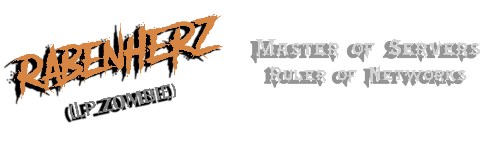

 
<h1 align="center">Hey there! Welcome to my profile </h1>

    
    ‎ ‎ ‎
    
    ‎ ‎ ‎
    

    My name is Rabenherz, also known by some as Lp_Zombie. I'm an IT specialist working at Serviceware SE, where I handle the security of the IT systems to ensure smooth operations.
      
    Apart from my work, I am passionate about self-hosting, which is why I have set up multiple V-Servers, Raspberry PIs, and Synology NAS to offer various web services and Discord bots. I love tinkering with new technology and experimenting with different coding languages. JavaScript and PowerShell are my favorites, and I always challenge myself with different programming projects to improve my skills.
     
    Another hobby of mine is reading manga, and I have an extensive manga collection that I am proud of. I enjoy hosting and sharing my collection with others who have a similar interest. In my free time, I like to unwind by playing Rouge-Likes or catching up on the latest anime.
      
    Overall, I am a driven individual who enjoys technology and the creative possibilities it offers. I always strive to learn new things and apply them to both my personal and professional life.

    Some of my manga library stats

    
        ‎ ‎ ‎
    
        ‎ ‎ ‎
    

    

<table style="width: 100%; border: 0px; table-layout:fixed;">
<tr>
<td border="0px" width="25%"></td>
<td border="0px" width="75%"><h2>Open Source is a great tool</h2>
    
Open-source software is something I am passionate about. While I may not be a heavy maintainer or contributor, and scripting are not my strong suit, I do what I can to contribute to the community. Whether it's fixing minor issues that might have been overlooked, making general improvements, helping with reviewing Pull Requests or enhancing documentation. I believe that every little bit helps when it comes to open-source projects.
</td>
</tr>
</table>

<h2 align="center"> Technologies & Tools </h2>
<table style="width: 100%; border: 0px; table-layout:fixed;">
<tr>
<td border="0px" width="75%">
<h2>Debian</h2>
    
Debian is a free and open-source operating system based on the Linux kernel. It is one of the most popular Linux distributions and is known for its stability, security, and community-driven development.  I use Debian for the most of my personal Infrastructure, since it's secure, doesn't need alot of ressources and is easy to manage.
</td>
<td border="0px" width="25%"></td>
</tr>
</table>
<table style="width: 100%; border: 0px; table-layout:fixed;">
<tr>
<td border="0px" width="25%"></td>
<td border="0px" width="75%"><h2>Windows 11</h2>
    
Windows is a widely used operating system developed by Microsoft. It offers a comprehensive and user-friendly platform for personal computing.  I use Windows on various personal and work devices and is my preferred operating system for productivity tasks and gaming.
</td>
</tr>
</table>
<table style="border: 0px;">
<tr>
<th>Languages</th>
<th>Shells</th>
<th>Databases</th>
<th>Cloud Providers</th>
<th>Code Management</th>
<th>Code Editors</th>
<th>Other</th>
</tr>
<tr>
<td></td>
<td></td>
<td></td>
<td></td>
<td></td>
<td></td>
<td></td>
</tr>
<tr>
<td></td>
<td></td>
<td></td>
<td></td>
<td></td>
<td></td>
<td></td>
</tr>
<tr>
<td></td>
<td></td>
<td></td>
<td></td>
<td></td>
<td></td>
<td></td>
</tr>
</table>

<h2 align="center">Latest Activities</h2>

<!--RECENT_ACTIVITY:start-->
(1) 💪 Opened PR [#965](https://github.com/awesome-selfhosted/awesome-selfhosted-data/pull/965) in [awesome-selfhosted/awesome-selfhosted-data](https://github.com/awesome-selfhosted/awesome-selfhosted-data) 
(2) 💪 Opened PR [#964](https://github.com/awesome-selfhosted/awesome-selfhosted-data/pull/964) in [awesome-selfhosted/awesome-selfhosted-data](https://github.com/awesome-selfhosted/awesome-selfhosted-data) 
(3) 💪 Opened PR [#963](https://github.com/awesome-selfhosted/awesome-selfhosted-data/pull/963) in [awesome-selfhosted/awesome-selfhosted-data](https://github.com/awesome-selfhosted/awesome-selfhosted-data) 
(4) ❌ Closed PR [#942](https://github.com/awesome-selfhosted/awesome-selfhosted-data/pull/942) in [awesome-selfhosted/awesome-selfhosted-data](https://github.com/awesome-selfhosted/awesome-selfhosted-data) 
(5) 👍 Approved [#943](https://github.com/awesome-selfhosted/awesome-selfhosted-data/pull/943#pullrequestreview-2440358995) in [awesome-selfhosted/awesome-selfhosted-data](https://github.com/awesome-selfhosted/awesome-selfhosted-data) 
(6) 💪 Opened PR [#962](https://github.com/awesome-selfhosted/awesome-selfhosted-data/pull/962) in [awesome-selfhosted/awesome-selfhosted-data](https://github.com/awesome-selfhosted/awesome-selfhosted-data) 
(7) 💪 Opened PR [#961](https://github.com/awesome-selfhosted/awesome-selfhosted-data/pull/961) in [awesome-selfhosted/awesome-selfhosted-data](https://github.com/awesome-selfhosted/awesome-selfhosted-data) 
(8) 👍 Approved [#878](https://github.com/awesome-selfhosted/awesome-selfhosted-data/pull/878#pullrequestreview-2440355654) in [awesome-selfhosted/awesome-selfhosted-data](https://github.com/awesome-selfhosted/awesome-selfhosted-data) 
(9) 👍 Approved [#947](https://github.com/awesome-selfhosted/awesome-selfhosted-data/pull/947#pullrequestreview-2440354703) in [awesome-selfhosted/awesome-selfhosted-data](https://github.com/awesome-selfhosted/awesome-selfhosted-data) 
(10) ❌ Closed PR [#956](https://github.com/awesome-selfhosted/awesome-selfhosted-data/pull/956) in [awesome-selfhosted/awesome-selfhosted-data](https://github.com/awesome-selfhosted/awesome-selfhosted-data) 
(11) 👍 Approved [#935](https://github.com/awesome-selfhosted/awesome-selfhosted-data/pull/935#pullrequestreview-2425287805) in [awesome-selfhosted/awesome-selfhosted-data](https://github.com/awesome-selfhosted/awesome-selfhosted-data) 
(12) ✔️ Closed issue [#936](https://github.com/awesome-selfhosted/awesome-selfhosted-data/issues/936) in [awesome-selfhosted/awesome-selfhosted-data](https://github.com/awesome-selfhosted/awesome-selfhosted-data) 
<!--RECENT_ACTIVITY:end-->

<!--RECENT_ACTIVITY:last_update-->
Last Updated: Wednesday, November 20th, 2024, 2:07:17 AM
<!--RECENT_ACTIVITY:last_update_end-->

<h2 align="center">GitHub Statistics</h2>

 

 

