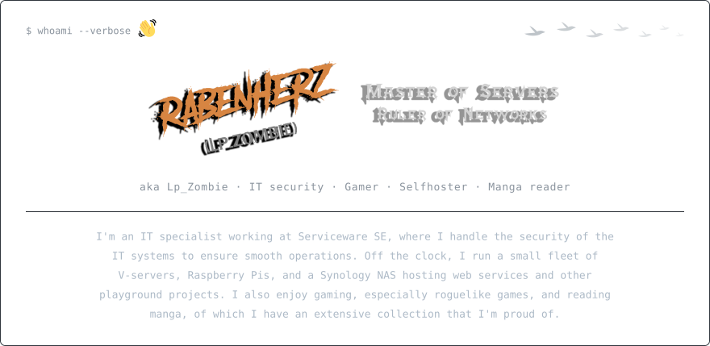
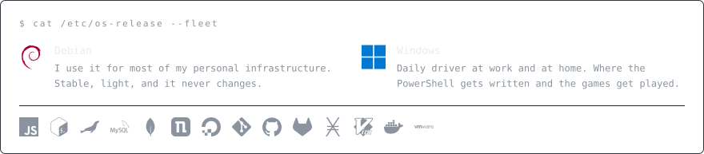
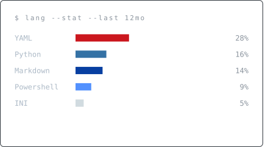
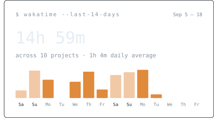
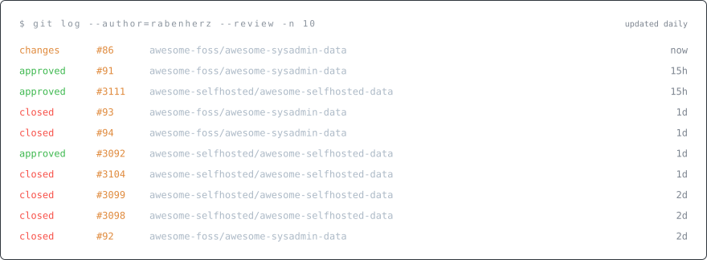
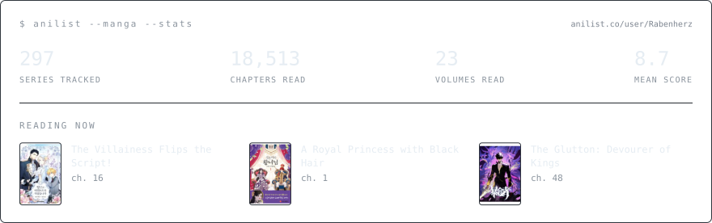
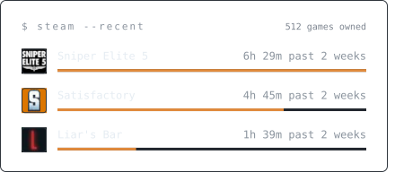
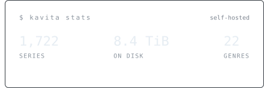

<!--
  This file is the hand-written shell of the profile. The panels are SVGs under
  cards/, rebuilt by .github/workflows/cards.yml; do not edit those by hand.

  Each panel is placed twice, in a <picture> block, so GitHub can swap the dark
  and light variant per viewer. The cards paint no background of their own, so
  they also sit correctly on the Dark dimmed and Dark high contrast themes,
  which prefers-color-scheme cannot tell apart from the default dark.

  Two layout rules hold the page square, and both are easy to undo by accident:

  Every panel is wrapped in a 
. Markdown gives a paragraph a 16px bottom
  margin and gives a bare <picture> nothing at all, so a panel written without
  the wrapper sits about 6px from the next one while its neighbours sit 22px
  apart. The wrapper is the whole of what keeps the vertical rhythm even.

  A row of two panels is written on one line with no space anywhere inside it,
  and each half is 50% wide. Images are inline, so any newline or space between
  the two <picture> tags -- or between an  and its closing </picture> --
  becomes a real 4px space on the line. That space is why the halves were 49%
  for as long as this was written across several lines: at 50% they no longer
  fit, and the second one wrapped onto a line of its own. The cost was a row
  12px narrower than every full-width card around it. The gap between the two
  boxes is transparent padding inside the images instead, which is what
  internal/cards.RenderPair is for.

  The link tiles and the view counter are the only things here that are not
  flat images baked at build time. Each tile is its own image because a link
  has to wrap the whole of one.

  The only generated part of this file is the date line between the
  "generated:start" and "generated:end" markers at the bottom. It is currently
  written commented out; see stampVisible in cmd/gencards/main.go.
-->

<picture>
  <source media="(prefers-color-scheme: dark)" srcset="./cards/header-dark.svg">
  <source media="(prefers-color-scheme: light)" srcset="./cards/header-light.svg">
  
</picture>

  <a href="mailto:rabenherz@theravenhub.com" title="Mail"><picture><source media="(prefers-color-scheme: dark)" srcset="./cards/link-mail-dark.svg"><source media="(prefers-color-scheme: light)" srcset="./cards/link-mail-light.svg"></picture></a>
  <a href="https://discord.gg/ySk5eYrrjG" title="Discord"><picture><source media="(prefers-color-scheme: dark)" srcset="./cards/link-discord-dark.svg"><source media="(prefers-color-scheme: light)" srcset="./cards/link-discord-light.svg"></picture></a>
  <a href="https://lemmy.world/u/Rabenherz112" title="Lemmy"><picture><source media="(prefers-color-scheme: dark)" srcset="./cards/link-lemmy-dark.svg"><source media="(prefers-color-scheme: light)" srcset="./cards/link-lemmy-light.svg"></picture></a>
  <a href="https://anilist.co/user/Rabenherz" title="AniList"><picture><source media="(prefers-color-scheme: dark)" srcset="./cards/link-anilist-dark.svg"><source media="(prefers-color-scheme: light)" srcset="./cards/link-anilist-light.svg"></picture></a>
  <a href="https://steamcommunity.com/id/rabenherz" title="Steam"><picture><source media="(prefers-color-scheme: dark)" srcset="./cards/link-steam-dark.svg"><source media="(prefers-color-scheme: light)" srcset="./cards/link-steam-light.svg"></picture></a>
  <a href="https://theravenhub.com" title="theravenhub.com"><picture><source media="(prefers-color-scheme: dark)" srcset="./cards/link-web-dark.svg"><source media="(prefers-color-scheme: light)" srcset="./cards/link-web-light.svg"></picture></a>

<picture>
  <source media="(prefers-color-scheme: dark)" srcset="./cards/fleet-dark.svg">
  <source media="(prefers-color-scheme: light)" srcset="./cards/fleet-light.svg">
  
</picture>

<!-- One line, no spaces: see the note at the top of this file. -->

<picture><source media="(prefers-color-scheme: dark)" srcset="./cards/languages-dark.svg"><source media="(prefers-color-scheme: light)" srcset="./cards/languages-light.svg"></picture><picture><source media="(prefers-color-scheme: dark)" srcset="./cards/wakatime-dark.svg"><source media="(prefers-color-scheme: light)" srcset="./cards/wakatime-light.svg"></picture>

<picture>
  <source media="(prefers-color-scheme: dark)" srcset="./cards/activity-dark.svg">
  <source media="(prefers-color-scheme: light)" srcset="./cards/activity-light.svg">
  
</picture>

<picture>
  <source media="(prefers-color-scheme: dark)" srcset="./cards/anilist-dark.svg">
  <source media="(prefers-color-scheme: light)" srcset="./cards/anilist-light.svg">
  
</picture>

<!-- One line, no spaces: see the note at the top of this file. -->

<picture><source media="(prefers-color-scheme: dark)" srcset="./cards/steam-dark.svg"><source media="(prefers-color-scheme: light)" srcset="./cards/steam-light.svg"></picture><picture><source media="(prefers-color-scheme: dark)" srcset="./cards/kavita-dark.svg"><source media="(prefers-color-scheme: light)" srcset="./cards/kavita-light.svg"></picture>

<!--
  The counter is the one thing on this page that is fetched live rather than
  generated: being fetched is what counts the view, so it cannot be cached and
  cannot be baked into a card. Source in counter/.

  It is a bare  on purpose, where every other panel here uses <picture>.
  A <picture> makes the browser start fetching the  fallback before it
  resolves which <source> to use and abort it once it knows, so one view can
  reach the server twice and the count drifts up. This image switches palette
  inside itself instead, on a prefers-color-scheme media query.

  A bare  on its own line is already a paragraph to markdown, so it needs
  no 
 of its own to be spaced like the panels above it.
-->

<!-- generated:start -->
<!-- 
generated 2026-09-12 · rebuilt daily by <code>.github/workflows</code>
 -->
<!-- generated:end -->
